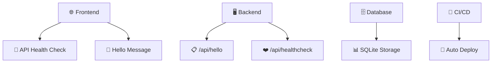
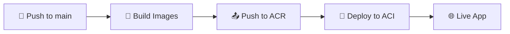
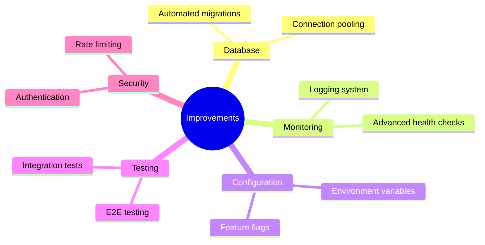

# 🚀 Full Stack App Setup

<div align="center">

**A modern full-stack web application demonstrating end-to-end development and deployment**

[](https://github.com/your-repo/actions)
[](https://vitejs.dev/)
[](https://flask.palletsprojects.com/)
[](https://sqlite.org/)
[](https://azure.microsoft.com/)

</div>

---

## 🎯 Overview

This project is a simple full-stack web application built and deployed as part of the **Maincode Software Development Engineer** take-home assignment. It demonstrates end-to-end setup, code clarity, and developer experience using modern tooling and cloud deployment.

## 🛠️ Tech Stack

<div align="center">

| Layer            | Technology                | Purpose                    |
| ---------------- | ------------------------- | -------------------------- |
| 🎨 **Frontend**  | React (Vite)              | Interactive user interface |
| ⚙️ **Backend**   | Python Flask              | REST API server            |
| 🗄️ **Database**  | SQLite                    | Data persistence           |
| 🐳 **Container** | Docker & Docker Compose   | Containerization           |
| ☁️ **Cloud**     | Azure Container Instances | Cloud deployment           |
| 🔄 **CI/CD**     | GitHub Actions            | Automated deployment       |

</div>

---

## ✨ Features

<div align="center">



</div>

- **🎨 Frontend:** Displays a "Hello, Maincode!" message and checks API health
- **⚙️ Backend:** Provides `/api/hello` and `/api/healthcheck` endpoints
- **🗄️ Database:** SQLite with basic initialization and usage
- **❤️ Health Check:** `/api/healthcheck` endpoint for monitoring
- **🔄 CI/CD:** Automated build and deployment via GitHub Actions

---

## 🏠 Local Development

### 📋 Prerequisites

<div align="center">

| Tool       | Purpose           | Link                                               |
| ---------- | ----------------- | -------------------------------------------------- |
| 🐳 Docker  | Containerization  | [Install Docker](https://www.docker.com/)          |
| 💻 VS Code | IDE (recommended) | [Download VS Code](https://code.visualstudio.com/) |

</div>

### 🚀 Quick Start

```bash
# 1️⃣ Clone the repository
git clone <your-repo-url>
cd maincode-app

# 2️⃣ Open in DevContainer (VS Code)
# Open folder in VS Code → "Reopen in Container"

# 3️⃣ Run the stack
docker-compose up --build
```

<div align="center">

**🎉 Your app is now running!**

| Service     | URL                                            | Status   |
| ----------- | ---------------------------------------------- | -------- |
| 🎨 Frontend | [http://localhost:5173](http://localhost:5173) | ✅ Ready |
| ⚙️ Backend  | [http://localhost:8000](http://localhost:8000) | ✅ Ready |

</div>

---

## ☁️ Cloud Deployment (Azure Container Instances)

### 🤖 Automated Deployment

<div align="center">



</div>

**🎯 Workflow Overview:**

- ✅ Builds and pushes Docker images for frontend and backend to Azure Container Registry
- ✅ Deploys containers to Azure Container Instances with public DNS endpoints

### 🔧 Manual Setup

<details>
<summary>Click to expand manual deployment steps</summary>

#### 1️⃣ Azure Resources Setup

- 🏗️ Create an Azure account
- 📦 Set up a Resource Group
- 🏪 Create an Azure Container Registry
- 🤐 Set up Github secrets for all relevant Azure credentials

#### 2️⃣ GitHub Secrets Configuration

| Secret              | Description                  |
| ------------------- | ---------------------------- |
| `AZURE_CREDENTIALS` | Azure service principal JSON |
| `ACR_LOGIN_SERVER`  | Container registry URL       |
| `ACR_USERNAME`      | Registry username            |
| `ACR_PASSWORD`      | Registry password            |
| `RESOURCE_GROUP`    | Azure resource group name    |
| `ACI_BACKEND_NAME`  | Backend container name       |
| `ACI_BACKEND_DNS`   | Backend DNS label            |
| `ACI_FRONTEND_NAME` | Frontend container name      |
| `ACI_FRONTEND_DNS`  | Frontend DNS label           |

#### 3️⃣ Deploy

Push to `main` branch and watch the magic happen! ✨

</details>

---

## ⚖️ Trade-offs & Limitations

<div align="center">

| Area              | Current State      | Limitation                               |
| ----------------- | ------------------ | ---------------------------------------- |
| 🗄️ **Database**   | SQLite             | Not suitable for production scale        |
| 🔒 **CORS**       | Basic config       | Must configure for deployed frontend URL |
| 🔐 **Secrets**    | GitHub Actions     | Time-consuming setup                     |
| 📊 **Migrations** | Manual             | No automated database migrations         |
| 🌿 **Branching**  | Main only          | No separate dev/UAT/prod workflows       |
| 🔍 **Language**   | JavaScript         | TypeScript would improve type safety     |
| 📈 **Monitoring** | Basic health check | Limited observability                    |

</div>

---

## 🎯 Areas for Improvement

<div align="center">



</div>

---

## 🎁 Optional Bonus Features

<div align="center">

| Feature             | Status         | Description                 |
| ------------------- | -------------- | --------------------------- |
| ❤️ Health Check     | ✅ Implemented | `/api/healthcheck` endpoint |
| 🔄 CI/CD Pipeline   | ✅ Implemented | GitHub Actions workflow     |
| 🐳 Containerization | ✅ Implemented | Docker & Docker Compose     |
| 🛡️ Error Handling   | ✅ Basic       | API error responses         |

</div>

---

## 📞 Contact

<div align="center">

**Questions or feedback?**

[](https://github.com/simrubin/fullstack-app-setup/issues)
[](mailto:simrubin13@gmail.com)

</div>
