# Full Stack App Setup

<div align="center">

[](https://github.com/simrubin/fullstack-app-setup/actions)
[](https://vitejs.dev/)
[](https://flask.palletsprojects.com/)
[](https://sqlite.org/)
[](https://azure.microsoft.com/)

</div>

---

## 🎯 Overview

This project is a simple full-stack web application built and deployed as part of the a Software Develpment take-home assignment. It demonstrates an end-to-end setup of a fullstack dev environment using modern tooling and cloud deployment.

## 🛠️ Tech Stack

<div align="center">

| Layer            | Technology                | Purpose              |
| ---------------- | ------------------------- | -------------------- |
| 🎨 **Frontend**  | React (Vite)              | User interface       |
| ⚙️ **Backend**   | Python Flask              | REST API server      |
| 🗄️ **Database**  | SQLite                    | Data persistence     |
| 🐳 **Container** | Docker & Docker Compose   | Containerization     |
| ☁️ **Cloud**     | Azure Container Instances | Cloud deployment     |
| 🔄 **CI/CD**     | GitHub Actions            | Automated deployment |

</div>

---

## ✨ Features

```mermaid
graph TD
    A[🌐 Frontend] --> B[📡 API Health Check]
    A --> C[👋 Hello Message]
    D[🖥️ Backend] --> E[📋 /api/hello]
    D --> F[❤️ /api/healthcheck]
    G[🗄️ Database] --> H[📊 SQLite Storage]
    I[🔄 CI/CD] --> J[🚀 Auto Deploy]
```

<div align="center">



</div>

- **🎨 Frontend:** Displays a "Hello, Maincode!" message and checks API health
- **⚙️ Backend:** Provides `/api/hello` and `/api/healthcheck` endpoints
- **🗄️ Database:** SQLite with basic initialization and usage
- **❤️ Health Check:** `/api/healthcheck` endpoint for monitoring
- **🔄 CI/CD:** Automated build, health check and deployment via GitHub Actions

---

## Additional Features

<div align="center">

| Feature           | Status         | Description                                                       |
| ----------------- | -------------- | ----------------------------------------------------------------- |
| ❤️ Health Check   | ✅ Implemented | `/api/healthcheck` endpoint                                       |
| 🔄 CI/CD Pipeline | ✅ Implemented | GitHub Actions workflow for health check and deployment           |
| 🛡️ Error Handling | ✅ Basic       | API error handling implemented using `tryCatch()` in the frontend |

</div>

---

## 🏠 Local Development

### 📋 Prerequisites

<div align="center">

| Tool      | Purpose          | Link                                      |
| --------- | ---------------- | ----------------------------------------- |
| 🐳 Docker | Containerization | [Install Docker](https://www.docker.com/) |

</div>

### 🚀 Quick Start

```bash
# 1️⃣ Clone the repository
git clone https://github.com/simrubin/fullstack-app-setup.git
cd fullstack-app-setup

# 2️⃣ Ensure Docker Desktop is open

# 3️⃣ Run the stack (locally)
docker-compose up --build

# 3️⃣ Run the stack in Dev Container
CMD+Shift+P -> Dev Containers: Rebuild and Reopen in Container
## Stack is run automatically in Dev Container
```

<div align="center">

**🎉 Your app is now running!**

| Service     | URL                                            | Status   |
| ----------- | ---------------------------------------------- | -------- |
| 🎨 Frontend | [http://localhost:5173](http://localhost:5173) | ✅ Ready |
| ⚙️ Backend  | [http://localhost:8000](http://localhost:8000) | ✅ Ready |

</div>

---

## ☁️ Cloud Deployment (Azure Container Instances)

### 🤖 Automated Deployment

```mermaid
graph LR
    A[📝 Push to main] --> B[🔨 Build Images]
    B --> C[📤 Push to ACR]
    C --> D[🚀 Deploy to ACI]
    D --> E[🌐 Live App]
```

<div align="center">



</div>

**🎯 Workflow Overview:**

- ✅ Builds and pushes Docker images for frontend and backend to Azure Container Registry
- ✅ Deploys containers to Azure Container Instances with public DNS endpoints

### 🔧 Manual Setup

<details>
<summary>Click to expand manual deployment steps</summary>

#### 1️⃣ Azure Resources Setup

- 🏗️ Create an Azure account
- 📦 Set up a Resource Group
- 🏪 Create an Azure Container Registry
- 🤐 Set up Github secrets for all relevant Azure credentials

#### 2️⃣ GitHub Secrets Configuration

| Secret              | Description                  |
| ------------------- | ---------------------------- |
| `AZURE_CREDENTIALS` | Azure service principal JSON |
| `ACR_LOGIN_SERVER`  | Container registry URL       |
| `ACR_USERNAME`      | Registry username            |
| `ACR_PASSWORD`      | Registry password            |
| `RESOURCE_GROUP`    | Azure resource group name    |
| `ACI_BACKEND_NAME`  | Backend container name       |
| `ACI_BACKEND_DNS`   | Backend DNS label            |
| `ACI_FRONTEND_NAME` | Frontend container name      |
| `ACI_FRONTEND_DNS`  | Frontend DNS label           |

#### 3️⃣ Deploy

Push to `main` branch and the CI/CD pipeline will take care of the rest.

My Deployed Azure Containers can be found at:
Frontend - http://simeon-frontend-717.australiasoutheast.azurecontainer.io:5173/
Backend - http://simeon-backend-717.australiasoutheast.azurecontainer.io:5000/

</details>

---

## 🎯 Areas for Improvement

### Console Logs in Prod

> Whilst I recognise it's not good practice to have console logs in a prod environment,  
> these are simply used to show that the local env and the deployed container both call the APIs  
> from the correct endpoints.

---

### Improvements for API Endpoints

- I would add authentication for APIs such as Token-based or session auth (e.g. JWT, OAuth)
- I would use a rate limiter to avoid abuse

---

### Improvements for Deployment and CI/CD

With more time I'd add:

- I would also add unit testing to the CI/CD setup with more time.
- Environment separation for dev, UAT and prod. Each with its own CI/CD pipeline and secrets.
- I would also add a proper branching system for this.
- HTTPS & Security support via a reverse proxy (i.e. Nginx).
- I would use a dedicated secrets manager to (i.e. Azure Key Vault) instead of storing them in Github actions.  
  This would allow for faster deployment setup.

---

### Database

SQLite is not suitable for production scale for larger apps.  
Azure SQL Database offers automatic scaling, high availability and security features which are more appropriate for larger apps.

---

### Improvements to Frontend

- I would use TypeScript for added type safety and also break the app up into separate UI components.
- I would also add a routing system like React-Router for navigation between pages.
- If I were to continue developing a larger frontend, I would use a CSS framework such as Tailwind CSS
  for more rapid and conveneint styling.

---

## 📞 Contact

<div align="center">

**Questions or feedback?**

[](https://github.com/simrubin/fullstack-app-setup/issues)
[](mailto:simrubin13@gmail.com)

</div>
